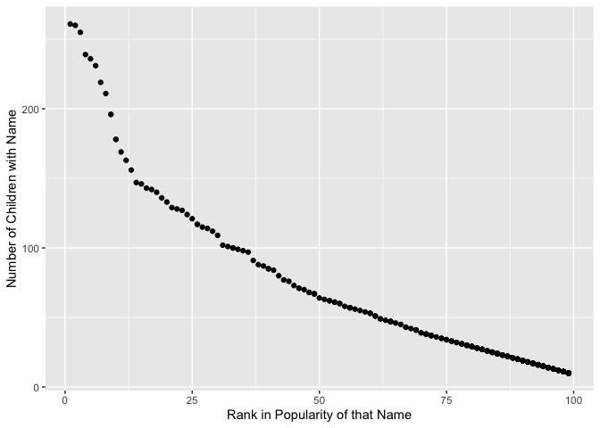

P8105 Homework 2 - Tanya Butt (thb2114)
================

## Problem 1

I will import the “Mr. Trash Wheel” dataset, clean the variable names,
remove non-specific dumpster data, and round the number of sports balls
to the nearest integer.

``` r
mr_trash_wheel_df = read_excel("Trash-Wheel-Collection-Totals-8-6-19.xlsx", 
                               range = "A2:N408")
mr_trash_wheel_df = janitor::clean_names(mr_trash_wheel_df) 
mr_trash_wheel_df = drop_na(mr_trash_wheel_df, dumpster) %>% 
  mutate(sports_balls = round(sports_balls, digits = 0))
```

I will now clean and combine the precipitation data for 2019 and 2018.
Rows without precipitation data were initially omitted, a year variable
was added, and the month variable was converted to a character variable.

``` r
precipitation_2019_df = read_excel("Trash-Wheel-Collection-Totals-8-6-19.xlsx", sheet = 4,
                               range = "A2:B14") 
precipitation_2019_df = drop_na(precipitation_2019_df, Total) %>% 
                        add_column(Year = "2019")

precipitation_2018_df = read_excel("Trash-Wheel-Collection-Totals-8-6-19.xlsx", sheet = 5,
                               range = "A2:B14") 
precipitation_2018_df = drop_na(precipitation_2018_df, Total) %>% 
                        add_column(Year = "2018")

precipitation_2018_2019_df = bind_rows(precipitation_2018_df, precipitation_2019_df) %>% 
  janitor::clean_names() %>% 
  pivot_wider(
    names_from = "year",
    values_from = "total") %>% 
  mutate(month = month.name[as.numeric(month)])

nrow(precipitation_2018_df)
## [1] 12
nrow(precipitation_2019_df)
## [1] 6
```

The overall “Mr. Trash Wheel” dataset includes the following variables:
dumpster, month, year, date, weight\_tons, volume\_cubic\_yards,
plastic\_bottles, polystyrene, cigarette\_butts, glass\_bottles,
grocery\_bags, chip\_bags, sports\_balls, homes\_powered. It has 14
columns and 344 observations.

Monthly and yearly precipitation amounts are also recorded in sheets in
the “Mr. Trash Wheel” dataset. The variables included in these sheets
are: Month, Total, Year.

In 2018, there were 12 months of precipitation. In 2019, only 6 months
of precipitation were recorded.

``` r
total_precip_2018 = sum(pull(precipitation_2018_2019_df, `2018`))
```

For 2018, the total amount of precipitation was 70.33 in.

``` r
mr_trash_wheel_df = select(mr_trash_wheel_df,year, sports_balls) %>% 
  filter(year == "2019")

median_sports_balls_2019 = median(pull(mr_trash_wheel_df, sports_balls))
median_sports_balls_2019 = round(median_sports_balls_2019, digits = 0)
```

The median number of sports balls in a dumpster in 2019 was 8.

## Problem 2

I will merge 3 datasets from FiveThirtyEight into a single dataset using
year and month.

``` r
pols_month_df = read_csv("pols-month.csv") %>% 
  janitor::clean_names() %>% 
  separate(mon, c("year", "month", "day")) %>% 
  mutate(year = as.numeric(year)) %>% 
  mutate(month = month.name[as.numeric(month)], month = str_to_lower(month)) %>% 
  mutate(day = as.numeric(day)) %>% 
  mutate(prez_gop = recode(prez_gop, `0` = "dem", `1` = "gop", `2` = "gop")) %>% 
  select(year, month, prez_gop, gov_gop, sen_gop, rep_gop, gov_dem, sen_dem, rep_dem) %>% 
  rename(president = prez_gop)
## Rows: 822 Columns: 9
## ── Column specification ────────────────────────────────────────────────────────
## Delimiter: ","
## dbl  (8): prez_gop, gov_gop, sen_gop, rep_gop, prez_dem, gov_dem, sen_dem, r...
## date (1): mon
## 
## ℹ Use `spec()` to retrieve the full column specification for this data.
## ℹ Specify the column types or set `show_col_types = FALSE` to quiet this message.
snp_df = read_csv("snp.csv") %>% 
  janitor::clean_names() %>% 
  mutate(date = mdy(date)) %>% 
  mutate_at(vars(date), funs(year, month, day))  %>% 
  mutate(month = month.name[as.numeric(month)], month = str_to_lower(month)) %>% 
  relocate(year, month, day, close) %>% 
  select(year, month, close)
## Rows: 787 Columns: 2
## ── Column specification ────────────────────────────────────────────────────────
## Delimiter: ","
## chr (1): date
## dbl (1): close
## 
## ℹ Use `spec()` to retrieve the full column specification for this data.
## ℹ Specify the column types or set `show_col_types = FALSE` to quiet this message.
## Warning: `funs()` was deprecated in dplyr 0.8.0.
## Please use a list of either functions or lambdas: 
## 
##   # Simple named list: 
##   list(mean = mean, median = median)
## 
##   # Auto named with `tibble::lst()`: 
##   tibble::lst(mean, median)
## 
##   # Using lambdas
##   list(~ mean(., trim = .2), ~ median(., na.rm = TRUE))
## This warning is displayed once every 8 hours.
## Call `lifecycle::last_warnings()` to see where this warning was generated.
unemployment_df = read_csv("unemployment.csv") %>% 
  janitor::clean_names() %>% 
  pivot_longer(
    jan:dec,
    names_to = "month",
    values_to = "close")
## Rows: 68 Columns: 13
## ── Column specification ────────────────────────────────────────────────────────
## Delimiter: ","
## dbl (13): Year, Jan, Feb, Mar, Apr, May, Jun, Jul, Aug, Sep, Oct, Nov, Dec
## 
## ℹ Use `spec()` to retrieve the full column specification for this data.
## ℹ Specify the column types or set `show_col_types = FALSE` to quiet this message.
fivethirtyeight_df = left_join(pols_month_df, snp_df, by = c("year" = "year", "month" = "month"))
```

## Problem 3

I will now load the popular baby names dataset from NYC Open data. I
will rename the gender predictor, recode the ethnicity variable, and
remove duplicate rows.

``` r
babynames_df = read.csv("Popular_Baby_Names.csv") %>% 
  janitor::clean_names() %>% 
  rename(sex = gender) %>% 
  mutate(ethnicity = recode(ethnicity, "ASIAN AND PACI" = "ASIAN AND PACIFIC ISLANDER",
                            "BLACK NON HISP" = "BLACK NON HISPANIC", 
                            "WHITE NON HISP" = "WHITE NON HISPANIC")) %>% 
  distinct(year_of_birth, sex, ethnicity, child_s_first_name, count, rank)
```

I will now create a table showing the rank in popularity and name count
of the female baby name “Olivia” over time.

``` r
olivia_df = filter(babynames_df, child_s_first_name == "Olivia") %>% 
  pivot_wider(names_from = year_of_birth, values_from = c(rank,count), values_fill = 0) %>% 
  relocate(child_s_first_name, sex, ethnicity, rank_2013, count_2013, rank_2014, count_2014,
           rank_2015, count_2015, rank_2016, count_2016) %>% 
  rename("Child's Name" = child_s_first_name) %>% 
  rename(Sex = sex) %>% 
  rename("Race/Ethnicity" = ethnicity) %>% 
  rename("Rank in 2013" = rank_2013) %>% 
  rename("Count in 2013" = count_2013) %>% 
  rename("Rank in 2014" = rank_2014) %>% 
  rename("Count in 2014" = count_2014) %>%   
  rename("Rank in 2015" = rank_2015) %>% 
  rename("Count in 2015" = count_2015) %>% 
  rename("Rank in 2016" = rank_2016) %>% 
  rename("Count in 2016" = count_2016) %>% 
  knitr::kable()

olivia_df
```

| Child’s Name | Sex    | Race/Ethnicity             | Rank in 2013 | Count in 2013 | Rank in 2014 | Count in 2014 | Rank in 2015 | Count in 2015 | Rank in 2016 | Count in 2016 |
|:-------------|:-------|:---------------------------|-------------:|--------------:|-------------:|--------------:|-------------:|--------------:|-------------:|--------------:|
| Olivia       | FEMALE | ASIAN AND PACIFIC ISLANDER |            3 |           109 |            1 |           141 |            1 |           188 |            1 |           172 |
| Olivia       | FEMALE | BLACK NON HISPANIC         |            6 |            64 |            8 |            52 |            4 |            82 |            8 |            49 |
| Olivia       | FEMALE | HISPANIC                   |           22 |            87 |           16 |            96 |           16 |            94 |           13 |           108 |
| Olivia       | FEMALE | WHITE NON HISPANIC         |            1 |           233 |            1 |           248 |            1 |           225 |            1 |           230 |

I will now produce a table ranking the most popular name among male
children over time.

``` r
popular_male_names_df = select(babynames_df, year_of_birth, sex, ethnicity, child_s_first_name, rank) %>% 
  filter(sex == "MALE", rank == '1') %>% 
  pivot_wider(names_from = year_of_birth, values_from = rank) %>% 
  relocate(child_s_first_name, ethnicity, '2016', '2015', '2014', '2013', '2012', '2011') %>% 
  select(child_s_first_name, ethnicity, '2016', '2015', '2014', '2013', '2012', '2011') %>% 
  rename("Child's Name" = child_s_first_name) %>% 
  rename("Race/Ethnicity" = ethnicity) %>% 
  rename("Rank in 2016" = '2016') %>% 
  rename("Rank in 2015" = '2015') %>% 
  rename("Rank in 2014" = '2014') %>% 
  rename("Rank in 2013" = '2013') %>% 
  rename("Rank in 2012" = '2012') %>% 
  rename("Rank in 2011" = '2011') %>% 
  knitr::kable()

popular_male_names_df
```

| Child’s Name | Race/Ethnicity             | Rank in 2016 | Rank in 2015 | Rank in 2014 | Rank in 2013 | Rank in 2012 | Rank in 2011 |
|:-------------|:---------------------------|-------------:|-------------:|-------------:|-------------:|-------------:|-------------:|
| Ethan        | ASIAN AND PACIFIC ISLANDER |            1 |           NA |           NA |           NA |           NA |           NA |
| Noah         | BLACK NON HISPANIC         |            1 |            1 |           NA |           NA |           NA |           NA |
| Liam         | HISPANIC                   |            1 |            1 |            1 |           NA |           NA |           NA |
| Joseph       | WHITE NON HISPANIC         |            1 |           NA |            1 |           NA |           NA |           NA |
| Jayden       | ASIAN AND PACIFIC ISLANDER |           NA |            1 |            1 |            1 |           NA |           NA |
| David        | WHITE NON HISPANIC         |           NA |            1 |           NA |            1 |           NA |           NA |
| Ethan        | BLACK NON HISPANIC         |           NA |           NA |            1 |            1 |           NA |           NA |
| Jayden       | HISPANIC                   |           NA |           NA |           NA |            1 |           NA |           NA |
| RYAN         | ASIAN AND PACIFIC ISLANDER |           NA |           NA |           NA |           NA |            1 |           NA |
| JAYDEN       | BLACK NON HISPANIC         |           NA |           NA |           NA |           NA |            1 |            1 |
| JAYDEN       | HISPANIC                   |           NA |           NA |           NA |           NA |            1 |            1 |
| JOSEPH       | WHITE NON HISPANIC         |           NA |           NA |           NA |           NA |            1 |           NA |
| ETHAN        | ASIAN AND PACIFIC ISLANDER |           NA |           NA |           NA |           NA |           NA |            1 |
| MICHAEL      | WHITE NON HISPANIC         |           NA |           NA |           NA |           NA |           NA |            1 |

I will now create a scatter plot showing the number of children with a
name vs. the rank in popularity of that name, for white non-hispanic
children born in 2016.

``` r
scatter_plot_df = select(babynames_df, year_of_birth, sex, ethnicity, child_s_first_name, rank) %>% 
                         filter(year_of_birth == '2016', sex == "MALE", ethnicity == "WHITE NON HISPANIC")

ggplot(scatter_plot_df, aes(x = rank, y = child_s_first_name)) + geom_point()
```

<!-- -->
